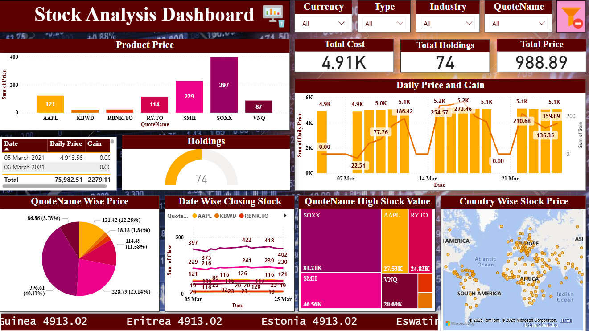

# 📊 Power BI Stock Analysis Dashboard

This project is a comprehensive *Stock Market Analysis Dashboard* built using *Power BI*. It provides visual insights into stock performance, trends, key metrics, and trading volumes to help investors and analysts make informed decisions.

---

## 🧠 Project Objective

To design an interactive Power BI dashboard that allows users to:

- Monitor stock price trends over time
- Analyze trading volume and volatility
- Compare performance of multiple stocks
- Identify top gainers and losers in selected timeframes
- Gain insights from historical stock data for investment decisions

---

## 🛠 Tools & Technologies Used

- *Power BI* – for building interactive and dynamic dashboards  
- *Microsoft Excel* – for data cleaning, transformation, and preprocessing  
- *DAX (Data Analysis Expressions)* – for creating calculated columns, measures, and KPIs  
- *Power Query Editor* – for data shaping, filtering, and transformation within Power BI  
- *Data Modeling* – to build relationships between multiple tables (e.g., stocks, sectors, dates)  
- *Time Intelligence Functions* – for YTD, MTD, and trend comparisons over time  
- *Slicers & Filters* – to enable user-driven insights across different time periods and stock categories  
- *Bookmarks and Tooltips* – to enhance interactivity and user experience  
- *Data Visualization Best Practices* – using charts, graphs, KPIs, and color coding for maximum readability and insight clarity  

---

## 📸 Dashboard Preview

